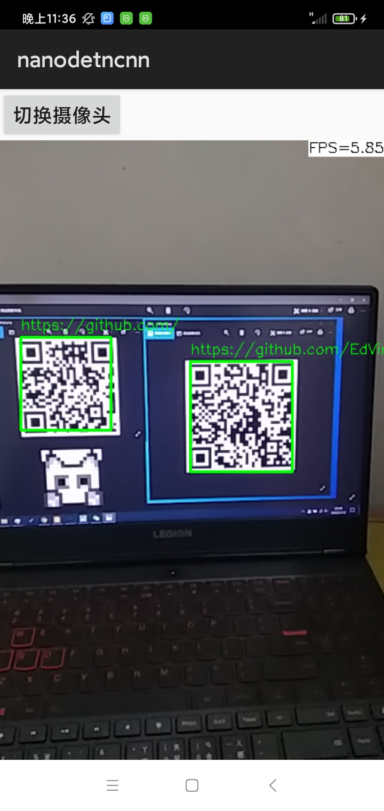

### WeChat-QRCode-NCNN
WeChatQRCode是微信AI团队推出的二维码引擎，但原工作采用caffe，开源于OpenCV

（！！！这个原始引擎不是我做的，我只是移植而已！！！）

本人是ncnn狂热爱好者，看不得腾讯家的东西被caffe ntr了，因此把它弄到ncnn上，正本清源。

公众号介绍：[传送门](https://mp.weixin.qq.com/s/AknsKNqVmvr8aohV25_ZcQ)

原始代码：[传送门](https://github.com/opencv/opencv_contrib/tree/master/modules/wechat_qrcode)

本项目工作：将该引擎的推理部分从caffe挪到了腾讯自家的ncnn上
#### 简单介绍
该版本引擎工作流程简单介绍：
1. 二维码检测，ncnn跑detect模型
2. 二维码超分，ncnn跑sr模型
3. 二维码解码，使用zxing-cpp
#### 优点
1. 调用简单：
```c++
cv::Ptr<cv::wechat_qrcode::WeChatQRCode> detector = cv::makePtr<cv::wechat_qrcode::WeChatQRCode>("assert/detect.param", "assert/detect.bin", "assert/sr.param", "assert/sr.bin");
vector<cv::Mat> points;
vector<string> res = detector->detectAndDecode(img, points);
```
2. 工程小：
detect模型+sr模型加起来只有960KB，即便是直接编译到工程里面也非常小
#### 效果
<br/>

说明：手机是红米7，骁龙632（超级典型的百元机），代码是实时一直检测和解码的所以用起来可能会觉得比较卡，设备好的话应该不会卡，而且实际使用都是one-shot的，应该没人跑实时的吧。

该APP已导出debug版本，[here](./Project_android/com.tencent.nanodetncnn-debug.apk)
#### 工作内容
 - [x] x86平台的工作
 - [x] android平台的工作
#### 声明
1. 原始的推理引擎属于腾讯微信AI团队在OpenCV上的开源
2. 本人所作工作仅仅是将推理的引擎从caffe换到了ncnn
3. 商用等请参照官方的License！！！
4. 开源不易（跪求star
